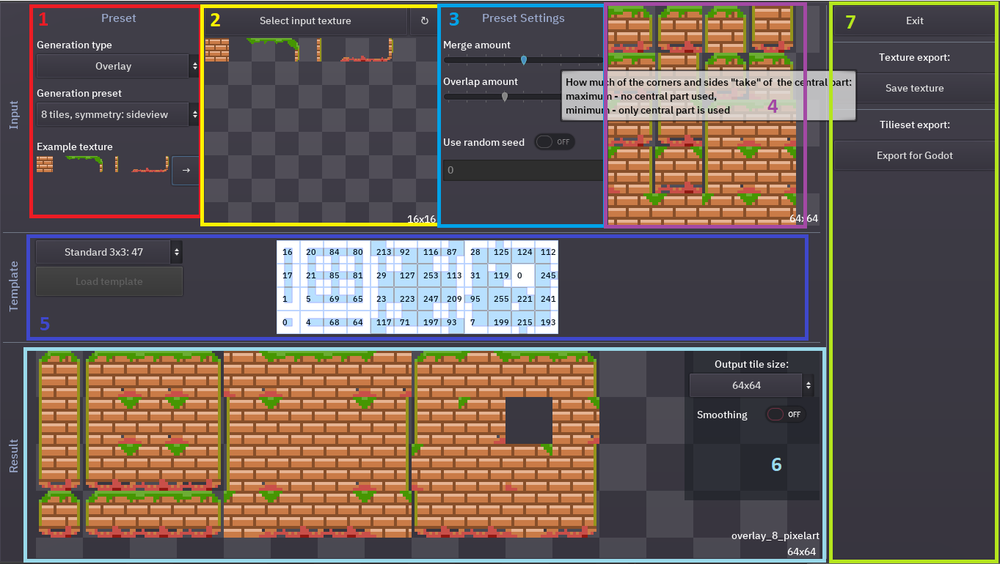
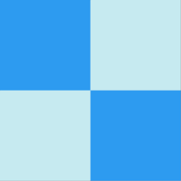
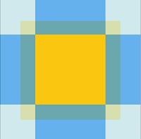
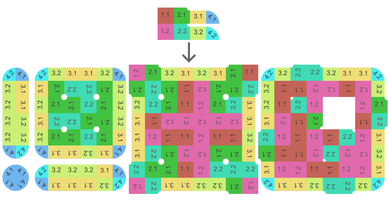
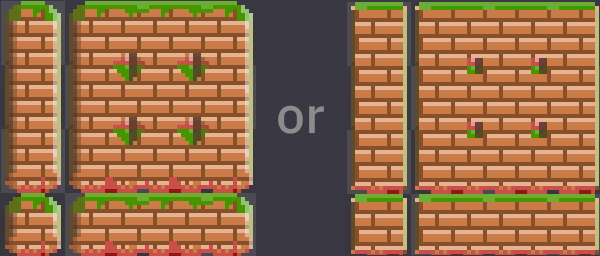

# TilePipe tutorial

Here is a quick rundown on how to create autoule-ready tilesets with Tilepipe and this program is all about. 

### What are autotiles and what is the problem?
With specially prepared tilesets you can paint maps in your games and tile variations like corners or sides are substituted by game engine. But to prepare those tilesets you have to copy-paste the same tile fragments which may be a lot of manual work. So here is this automation tool, which copies the tile parts around and combines them in various ways. There are several different types of autotiling, but the most usable for me was 47-tile blob tileset, you can read more on it here www.cr31.co.uk/stagecast/wang/blob.html. 

### What is TilePipe?
The name TilePipe comes from “tileset pipeline” since it is targeted at automating the tileset creation process. Desired workflow is - you draw only the parts of tiles that differ between tile types, like the corner of the tile differs from the side or from the center. All the copying is then done automatically by TilePipe.

### So, how to use the program?
There are 2 inputs in the process - one is the drawing of the parts that are repeated in tiles and the other is the template of how to position the resulting tiles. You have to draw tile parts for TilePipe in your favourite graphical editor. The template default is set for 47-tile blobs and in most cases you are good with it. In the popular program “Tiled” this type of tilesets are called “Mixed sets” with 2 types of terrain.

### The UI overview
Let’s take a quick look at the interface. Here is how the UI looks currently (0.1.4):

1. At the top left you see the generation type selector and the preset you want to use. 
2. Next there is the part for your input drawing with the file selector. 
3. Further to the right you see the settings that can vary according to the chosen generation type. 
4. The part on the top right is the “preview” for generated tiles.
5. In the middle there is the template used to place the tiles in the resulting tileset. 
6. At the bottom you can see the resulting tileset preview and some options including scaling and smoothing, which is the desired option for pixel-art.
7. The outmost right part has the buttons for saving the tileset as an image or exporting to the Godot autotile tileset. Other export formats may be supported later.

### Generation settings
#### Generation type
First of all you need to select the generation type. The default generation combines the quarters of the tile to create a full tile. This is useful for creating movement highlight tilesets and such, because they are usually simpler than game map tiles. The other type merges a tile from 9 parts - center, 4 sides and 4 corners with possible overlap. It overlays the corner over the center part, that’s why it’s called “Overlay”. 

The first images shows how the tile is composed from quarters and the second - an overlay composition, center is placed under the sides and corners:

#### Generation preset
Next you can choose the preset to use. Quarter merge generation has 2 presets and overlay type has three. For both generation types the 4-part preset is the most basic and easy to understand. For the quarter merge 5-part preset I added the 5th quarter type to use around corners for the result to look more interesting. As for overlay generation, the 8-part preset is used for sideview tilemaps, as the top and bottom sides and corners would vary in that case. The 13-tile is used when the sides vary also, for example, have a shadow on one side.
#### Preset input example
Under the preset selection there is the example, which can be used to better understand what’s going on or how to prepare your own input drawing. 

### Preparing input drawings
All the example drawings you can download separately from the program from itch.io page. Creating your own drawings can be a bit tricky since you have to keep in mind where the tiles will merge with each other. 

#### Quarters
For quarters I would say it’s a lot harder to keep the tiles seemless, since in the overlay mode you don’t have to worry about the borders inside the tile and can adjust the result a bit by settings in TilePipe. 
To make an input drawing for quarters merge you have to check that:
1. Every drawn border between quarters is seemless
2. The second and the last tile match themselves - their top and right borders will be combined in the output 
4. All the sides without border, which are: all 4 sides of the 1st quarter, left and bottom part of the 2nd, bottom of the 3rd (and bottom of the 4th in 5 quarter preset) are combined smoothly

Connecting borders for 4-quarters preset:

Due to those limitations quarters are only good for tilesets with solid fill, like those move areas in turn-based games. 

#### Overlaying
For the Overlay presets you have to worry about how the sides and corners merge with the center part, but that can be adjusted from the UI. How to make the seamless merge between tiles is rather obvious here, but if it’s not, ask me in the comments or with any of the contacts provided below the video. 

For example, with input like this for overlay-13 no symmetry 

You can get autotile-ready tileset like this 

### Generation settings
#### Randomization
Both merge and overlay generation types have the random settings. “What random are you talking about?”, you might say.If you’ve noticed, in all input drawings the parts are placed in a row. Just add another row with altered parts to the image and the TilePipe will substitute random tile parts for every generated tile. You can use some predefined integer random seed to consistently substitute the same variants in the same tiles. It can be really useful, sometimes, trust me. While you don’t have a second row in your image, the random options is disabled. Randomisation is enabled if the aspect ratio of the input image suggests multiple rows with the chosen preset.

#### Overlay merge options
For merge-type generation there are no other options, but for overlay-type there are 2 sliders. 
1. First one is called “merge amount” and regulates how much of the corners and sides "take" of  the central part. With minimum the output will only consist of the center parts, with maximum, sides and corners will take all the space up to the center of each tile.
2. The second slider is called “overlap amount”. It modifies how much of the central part will be “shoved” under the corners and side. If the corners and sides have no transparent parts, it will not make any change in the result.
Example of applying different settings:

### Using different templates
Why would you use a custom template. There can be different motives to such a move. You can not like how the result looks, for example. But two of the most common ones are:

You want less tiles. If you know beforehand that in your game you won’t have all the 47 variations, you can create a custom template with only a part of the tiles. To do that, download the example and cut a part you don’t want. The program checks every tile in 9 points and if it finds the transparent part, it considers that there will be no tile on that side. Just cut the example template as you want and you’ll be good.

You want more tiles. Why would you want it? Some engines, like the Godot substitute random tiles in the tilemap, if they find similar tiles in the tileset. So it’s general useful when you are using random input, as TilePipe will generate another tile everytime it finds the same tile in the template.

### Output composition settings 
Here you can
- Scale the result up and down from the input. For now only several tile sizes are supported, but I plan to add custom tile sizes as well as margin between tiles.
- Change the smoothing. If you are working with pixelart, you want the smoothing to be on. Otherwise it should be generally on.

### Saving and exporting your results
If you are happy with the tileset in the preview at the bottom, you can save the result as a png. For now TilePipe can only export tileset resources in the Godot format. To do that you have to save the png first inside your Godot project tree, then you can export the Godot resource also inside the existing Godot project. Saving inside the existing project is required since the path to the image is used in the resource and it has to be relative or you wouldn’t be able to run your game on another computer.

### Notes
That’s it on a basic functionality. But here are a couple of notes:
- The project is still under development, so any of the info may change.
- For now there are no projects, so there can be only a singular autotile per file. 
- All your settings from the previous launch are stored automatically, including file input and output paths, so that opening the program you have all your previous work restored at the start.

**There may be some bugs or errors due to wrong input or something like that, please report them on the itch.io or the discord provided.**

## Return to [Main page](index.html)
