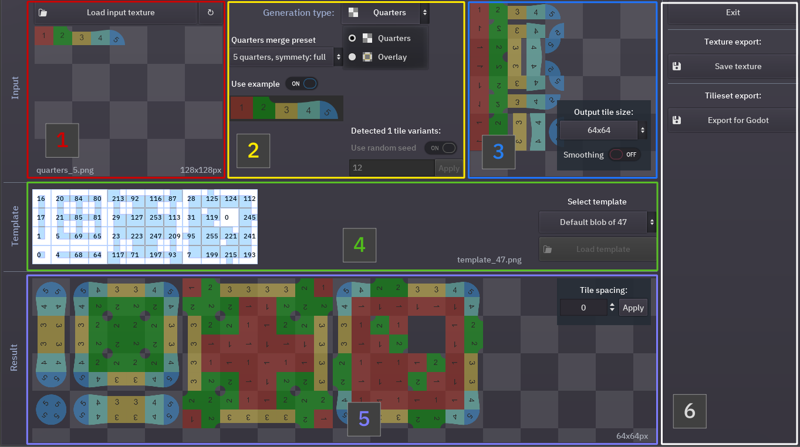
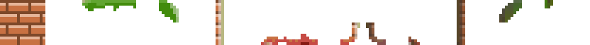
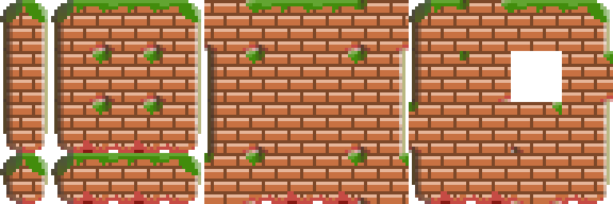
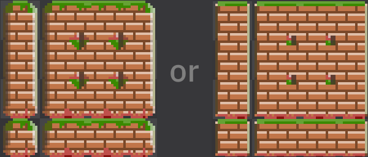

# TilePipe tutorial

Here is a quick rundown on how to create autoule-ready tilesets with Tilepipe.

### What are autotiles and what is the problem?
With specially prepared tilesets you can paint maps in your games and tile variations like corners or sides will be substituted by game engine. But to prepare those tilesets you have to copy-paste the same tile fragments which may be a lot of manual work. So here is this automation tool, which copies the tile parts and combines them in various ways. There are several different types of autotiling, but the most usable for me was 47-tile blob tileset, which takes into accounts both neighboring  sides and corners. You can read more on tiling [here](http://www.cr31.co.uk/stagecast/wang/blob.html). In the popular program “Tiled” this type of tilesets are called “Mixed sets” with 2 types of terrain.

### What is TilePipe?
The name TilePipe comes from “tileset pipeline” since it is targeted at automating the tileset creation process. Desired workflow is - you draw only the parts of tiles that differ between tile types, like the corner of the tile differs from the side or from the center and get the usable autotile-ready tileset. Then you fix something in the input image and rebuild the tileset quickly, then repeat it again and again.

### So, how to use the program?
First of all you need to draw the parts that are repeated in tiles. This is a drawing specific to the generation type and preset you use. For example, if you have a sideview game, your tiles may be symmetrical left to right but not symmetrical top to down. So you'll need different parts for top and down of tiles, but can use only one side. For now there are just a few presets, but more will be added in the next release.

You can also setup a template, which determines places for the tiles in the resulting tileset, but in most cases you are good with the default.  If you still want to do it, just rearrange tiles in the example texture.

### The UI overview
Here is how the UI looks currently (0.2):

1. In the top right there is preview of your selected texture, from which all the tiles will be generated.
2. Next in the top row is block with settings how exactly to combine the parts in the tiles.
3. The top right part is the “preview” for generated tiles with options of scaling and smoothing.
4. In the middle there is the template, which determines how to place the tiles in the resulting tileset.
5. At the bottom you can see the resulting tileset preview and a selector for spacing between the tiles.
6. The outmost right part has the buttons for saving the tileset as an image or exporting to the Godot autotile tileset. Other export formats are planned for later.

### Preparing input drawings

Creating your own drawings is the main part of creating tilesets with TilePipe. It can be a bit tricky since you have to keep in mind where the tiles and parts will merge with one another. 

The main thing that determines how the parts are combined is the generation type. The default generation combines quarters of a tile to create a full tile. This is useful for creating movement highlight tilesets and such, because they are usually simpler than game map tiles. 

The other type merges a tile from 9 parts - center, 4 sides and 4 corners with possible overlap. It overlays the corners over the center part, that’s why it’s called “Overlay”. 

#### Quarters

For quarters it’s a bit harder to keep the tiles merging seemless on the map, since in the overlay mode you don’t have to worry about the borders inside the tile and can adjust the result a bit through the settings in the TilePipe interface. 

Here is an example of 5-quarter input and 

some highlighted zones with the use of the resulting tileset

To make an input drawing for quarters merge you have to check that:

1. Every drawn border between quarters is seemless
2. The second and the last tile match themselves - their top and right borders will be combined in the output 
3. All the sides without border, which are: all 4 sides of the 1st quarter, left and bottom part of the 2nd, bottom of the 3rd (and bottom of the 4th in 5 quarter preset) are combined smoothly

Connecting borders for 4-quarters preset:

Due to those limitations quarters are mostly good for tilesets with solid fill, like those move areas in turn-based games. 

#### Overlaying

For the Overlay presets you have to worry about how the sides and corners merge with the center part, but that can be adjusted from the UI later. Making the seemless merge between tiles is easier here - you must take care of the center tile to match itself first and foremost.

For example, with input like this for overlay-13 no symmetry 

You can get autotile-ready tileset like this

### Generation settings

#### Generation type

The top selector selects exactly that, the details were already discussed above. Some of the settings are only applied to particular generation type.

#### Generation preset
Quarter-type generation has 2 presets and overlay-type currently has 3. For both generation types the 4-part preset is the most basic and easy to understand. In the quarter merge 5-part preset the 5th quarter type was added to always be used around corner quarters for the result to look more interesting. As for overlay generation, the 8-part preset is used for sideview tilemaps, as the top and bottom sides and corners would vary in that case. The 13-tile is used when the sides vary also, for example, have a shadow on one side.

#### Preset input example
Under the preset selection there is an example, which can be used to understand what’s going on or how to prepare your own input drawing. You can check "use example" box for them to be loaded as input images. All the examples plus some more can be found as PNG file in the same archive with the TilePipe executable.

#### Randomization
Both merge and overlay generation types have the random settings. “What random are you talking about?”, you might say. If you’ve noticed, in all input drawings the parts are placed in a row. Just add another row with altered parts to the image and the TilePipe will substitute random tile parts for every generated tile. You can use some predefined integer random seed to consistently substitute the same variants in the same tiles. It can be really useful, sometimes, trust me. While you don’t have a second row in your image, the random options is disabled. Randomization is enabled if the aspect ratio of the input image suggests multiple rows with the chosen preset, i.e. if the input for 4 quarter preset has the aspect ration more than 1:4.

#### Overlay merge options
For merge-type generation there are no other options, but for overlay-type there are 2 sliders. 
1. First one is called “merge amount” and regulates how much of the corners and sides "take" of  the central part. With minimum value, the output will only consist of the center parts, with maximum, sides and corners will take all the space up to the center of each tile.
2. The second slider is called “overlap amount”. It modifies how much of the central part will be “shoved” under the corners and sides. If the corners and sides have no transparent parts, it will not make any change in the result.
Example of applying different settings:

### Tile postprocessing settings 

Here you can

- Scale the result up and down from the input. For now only several tile sizes are supported, but I plan to add custom tile sizes as well as margin between tiles. You can also disable tile scaling and use the tile size determined form the input.
- Change the smoothing. If you are working with pixelart, you want the smoothing to be off. Otherwise it should be generally on.

The example result of smoothing on and off

### Using different templates

There can be different motives to using templates other than the default ones. But two of the most common reasons ones are:

**You want less tiles.** If you know beforehand that in your game you won’t have all the 47 variations, you can create a custom template with only a part of the tiles. To do that, download the example and cut a part you don’t want. The program checks every tile in 9 points and if it finds the transparent part, it considers that there will be no tile on that side. Just cut the example template as you want and you’ll be good.

**You want more tiles.** Most game engines, like the Godot substitute random tiles in the tilemap, if they find similar tiles in the tileset. So it is used when you are using random-ready input, as TilePipe will generate another tile everytime it finds the same tile in the template.

To modify the template, take one from example and rearrange the tiles. The numbers in the UI over the template are the binary masks detected.

Here is some custom template suggested in the Discord channel:

### Output tileset settings

You can some add spacing between tiles if you want. Sometimes it's useful too.

### Saving and exporting your results

If you are happy with the tileset in the preview at the bottom, you can save the result
#### Save texture
The texture you've made can be used in any map editor or can be tweaked in graphical editor before usage. For now if you want several autotiles in one texture, you'll need to combine them manually.
#### Export
For now TilePipe can only export tileset resources in the Godot 3.x format, so that you don't have to setup bitmasks for your autotile inside Godot tileset editor. Open the Godot 3 exporter and choose file name for your new or existing tileset, after that you can choose tile name, type and texture path to save to. Both tileset and output texture should be inside any existing Godot project tree. You can create a new tileset or add an autotile to an existing one, or even replace a tile in it.

### Notes
That’s it on a basic functionality. But here are a couple of notes:
- The project is still under development, so any of the info may change.
- UI state from the previous launch is stored automatically, so that opening the program you have all your previous work restored at the start.
- Instead of projects TilePipe saves UI state for every input file you load, so everything is also restored on openning a once openned input texture.

**There may be some bugs or errors due to wrong input or something like that, please report them on the itch.io or the discord provided.**

## Return to [Main page](index.html)
